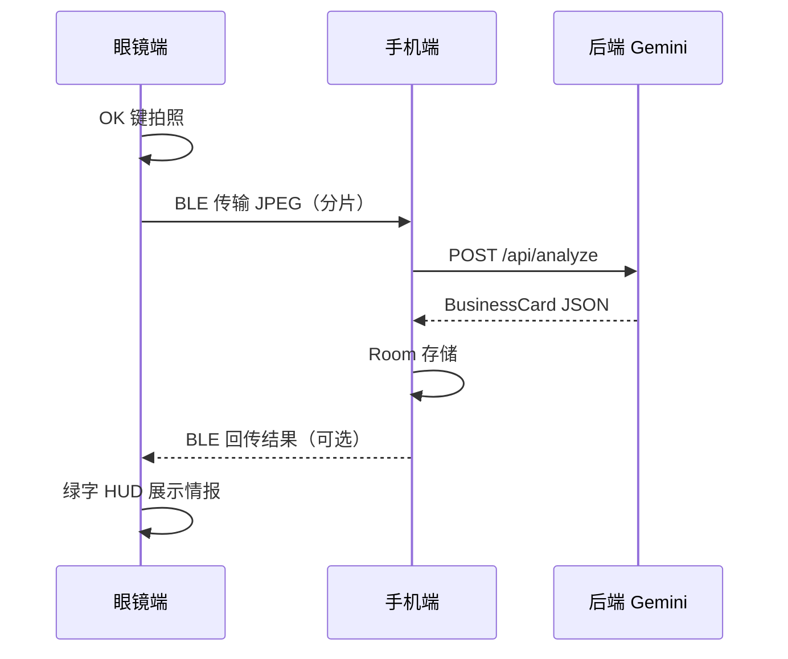

# HelloRokid v2 项目分析与优化方案

> 存档日期：2026-06-10

## 项目概览

**HelloRokid v2** 是一个基于 **Rokid 智能眼镜** 的 **名片扫描与商务情报** 系统，采用 Monorepo 架构，把「眼镜采集 → 手机处理 → 云端 AI 分析」拆成三个端协同完成。

---

## 项目结构

```
HelloRokid-v2/
├── shared/          # 共享模块（数据模型 + BLE 协议）
├── glass-app/       # Rokid 眼镜端 App
├── mobile-app/      # Android 手机端 App
└── backend/         # Python FastAPI 后端（Gemini 代理）
```

### 1. `shared` — 共享层

| 文件 | 作用 |
|------|------|
| `BusinessCard.kt` | 名片数据模型，字段很丰富（基础信息 + 商业推断） |
| `BleProtocol.kt` | BLE 协议常量（Service UUID、分片大小 512 等） |

`BusinessCard` 不只有姓名/电话，还包含 `industry`、`companySize`、`revenue`、`opportunities` 等 **AI 推断的商务情报**，这是产品差异化的基础。

### 2. `glass-app` — 眼镜端

- **交互**：按 OK 键扫描，上下键滚动结果
- **UI**：黑底绿字 Rokid 风格，结果面板设计了完整的多段信息展示
- **相机**：`RokidCameraManager` 已实现 Camera2 拍照
- **现状**：`MainActivity` 里仍是 **TODO + 测试假数据**，相机和 BLE 都未真正接入

布局里有很多 TextView（行业、营收、商机等），但代码只更新了 3 个字段。

### 3. `mobile-app` — 手机端

- **职责**：BLE Central 接收图片 → 调后端分析 → 本地存储 → 导出
- **已实现**：`BackendApiService`（OkHttp 调 `/api/analyze`，解析 JSON 为 `BusinessCard`）
- **现状**：BLE 是 `delay(2000)` 模拟；Room 数据库、名片列表、vCard/CSV 导出均未实现

### 4. `backend` — 后端

- **FastAPI** + **Gemini 2.0 Flash**
- 接收 Base64 图片，用结构化 Prompt 提取并 **推断** 16 个字段
- API Key 藏在服务端，手机端不暴露密钥 — 架构合理

### 5. 预期数据流



---

## 当前完成度

| 模块 | 状态 |
|------|------|
| Monorepo 架构 | ✅ 完成 |
| 共享数据模型 / BLE 协议定义 | ✅ 完成 |
| 眼镜 UI + 按键交互 | ✅ 完成 |
| 相机管理器 | ✅ 代码写好，未接入 |
| 后端 Gemini 分析 | ✅ 完成 |
| 手机 API 客户端 | ✅ 完成，未接入主流程 |
| BLE 实际通信 | ❌ 待实现 |
| Room 数据库 + 列表 | ❌ 待实现 |
| vCard / CSV 导出 | ❌ 待实现 |
| 眼镜端完整结果展示 | ❌ 布局有，逻辑未接 |

**结论**：骨架和方向清晰，核心链路（拍照 → BLE → AI → 存储 → 展示）还没打通，目前更像 **可演示的原型框架**。

---

## 优化与「更酷、更能得奖」的方向

下面按 **优先级** 和 **竞赛/demo 冲击力** 分层，方便取舍。

### 第一层：先打通 MVP（参赛底线）

没有完整链路，再酷的功能也演示不了。建议优先：

1. **打通端到端链路**：`RokidCameraManager` → BLE 分片传输 → `BackendApiService` → 结果回传眼镜
2. **补全眼镜 HUD**：把布局里所有字段都绑上 `BusinessCard` 数据
3. **手机端 Room + RecyclerView**：扫完能看历史、能点进详情
4. **vCard 一键导出**：评委和观众能立刻感知「有用」

---

### 第二层：突出「眼镜独有」体验（差异化）

普通手机扫名片 App 很多，**得奖要靠「只有眼镜能做到」的场景**。

#### 方案 A：**会展 Networking Copilot**（推荐主打）

**场景**：展会/路演，双手端着咖啡，边走边聊，眼镜帮你记人。

| 功能 | 说明 | 冲击力 |
|------|------|--------|
| 免提扫描 | 语音「扫描」或抬手 OK 键，无需掏手机 | ⭐⭐⭐ |
| 即时 HUD 简报 | 扫完 3 秒内在镜片显示：「张三 · CEO · 未来科技 · 主攻 AI 硬件」 | ⭐⭐⭐ |
| 谈话提示 | AI 生成 2–3 条破冰话题：「你们和 Rokid 在 XR 场景可能有合作…」 | ⭐⭐⭐⭐ |
| 会后 Follow-up | 手机自动生成跟进邮件草稿 | ⭐⭐⭐ |

**Demo 脚本**：戴上眼镜 → 对着名片按 OK → 镜片出现绿字情报 + 谈话建议 → 手机同步联系人 — 评委一眼看懂价值。

#### 方案 B：**实时名片瞄准辅助**

- 眼镜端加 **取景框/对齐提示**（「再靠近一点」「光线不足」）
- 扫前做简单质量检测，减少 AI 失败率
- 体现对 Rokid 硬件的理解，而不只是「另一个 OCR App」

#### 方案 C：**多模态名片**

- 纸质名片 + **微信二维码** + **LinkedIn QR**
- 眼镜拍一张，后端判断类型并走不同解析逻辑
- 国际化场景（海外展会）加分

---

### 第三层：AI 深度（技术亮点）

后端 Prompt 已经在做「推断」，可以更进一步：

#### 1. **商机匹配引擎**

用户预先填：「我是做 XX 的，想找 YY 合作方」。扫完名片后输出：

```
匹配度：85%
合作点：对方做 B 端 SaaS，你们做硬件入口
建议行动：约 15 分钟 demo
```

比单纯存联系人更有 **B2B 商务感**，适合创业/商业类比赛。

#### 2. **企业信息增强**

- 用公司名调公开 API（企查查、天眼查、或 Google）
- 把「AI 猜测的营收」换成「有据可查的数据 + AI 摘要」
- 展示时对比：「名片上只有名字 → 眼镜里是公司全貌」

#### 3. **多语言 + 翻译**

- 名片日文/韩文/英文 → 自动翻译 + 结构化
- 适合「国际化 + AI」主题赛道

#### 4. **关系图谱**

- 同一展会扫 20 张名片 → 自动生成关系网（同公司、同行业、潜在上下游）
- 手机端可视化，眼镜端显示「你们有 3 位共同联系人」

---

### 第四层：体验与产品化（评委印象分）

| 优化点 | 做法 |
|--------|------|
| **Event Mode** | 按活动分组（「2026 Rokid 开发者大会」），批量扫描、去重、统计 |
| **智能去重** | 同一人多张名片 / 模糊匹配合并 |
| **离线降级** | 无网时先存图，有网再分析；体现工程成熟度 |
| **隐私设计** | 本地加密、可选「不上传云端」— 商务场景很加分 |
| **语音反馈** | 扫完 TTS：「已记录张三，未来科技 CEO」— 免提闭环 |

---

### 第五层：竞赛 Presentation 策略

**产品命名建议**（比 HelloRokid 更有故事）：

- **CardLens** — 眼镜里的商务透镜
- **NetGlasses** — 会展社交眼镜
- **MeetIQ** — 见面即情报

**Demo 三幕结构**（约 3 分钟）：

1. **痛点**（30s）：会展递名片，信息记不住、跟进难
2. **魔法时刻**（90s）：戴眼镜扫名片 → 镜片实时情报 + 谈话建议
3. **闭环**（60s）：手机联系人、跟进邮件、导出、关系图

**技术亮点话术**：

- Monorepo 三端协同 + BLE 低功耗传输
- API Key 服务端托管
- Gemini 结构化提取 + 商务推断
- Rokid 原生 Camera2 + HUD 交互

---

## 推荐落地路线

如果目标是 **尽快能参赛 demo**，建议：

```
Week 1: 打通 BLE + 相机 + API + 眼镜完整展示
Week 2: Room 列表 + vCard 导出 + Event Mode
Week 3: 加 1 个「杀手功能」— 推荐「谈话提示」或「商机匹配」
Week 4: Demo 脚本打磨 + 异常处理（弱网、扫糊、重复）
```

**一个杀手功能胜过十个半成品**。在「名片 OCR」红海里，**「会展社交 Copilot」** 最贴合 Rokid 眼镜形态，也最容易在 demo 里打动评委。
